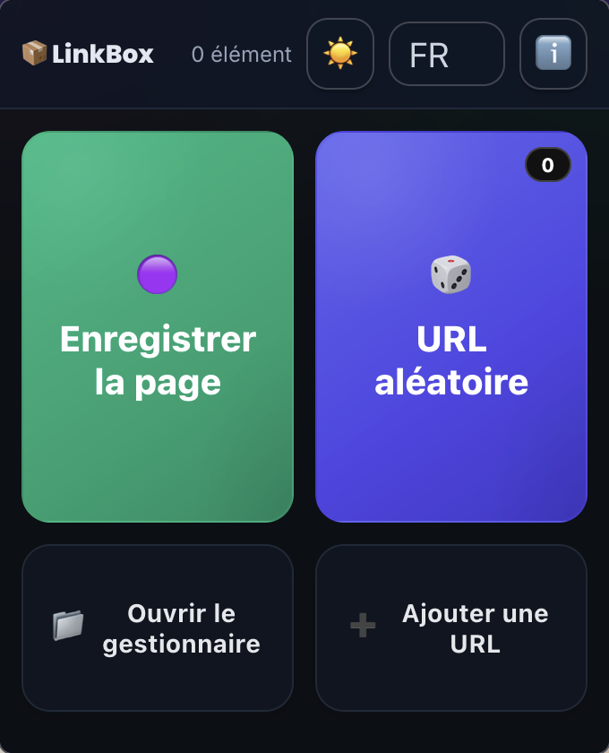
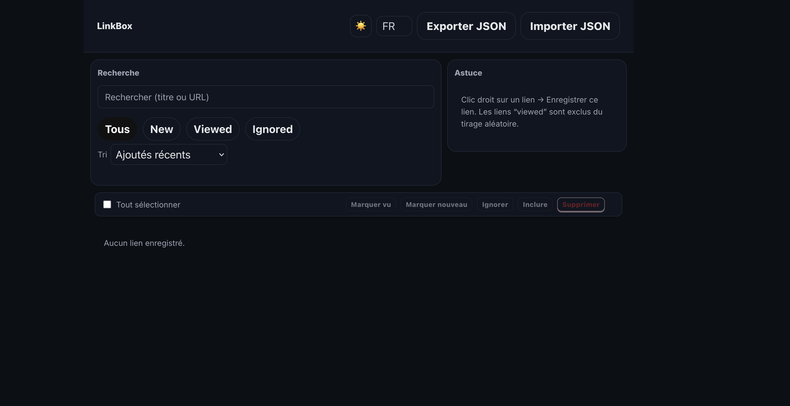
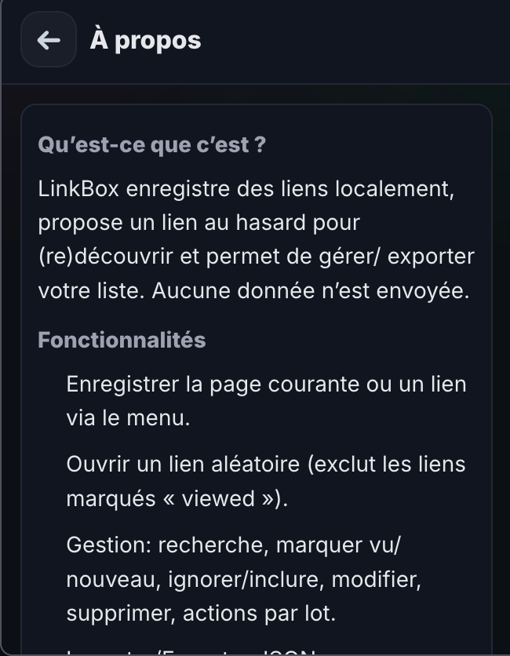

# LinkBox (MV2)

Save links, open a random one, and manage/import/export your list. 100% local data via browser.storage.local.

## Screenshots

### Popup Interface

*Quick access to save current page, open random link, or manage your collection*

### Manage Links

*View, edit, and organize all your saved links with tags*

### Informations

*View statistics and details about your link collection*

## Permissions
- `storage`: local persistence
- `tabs`: read current tab URL and open new tabs
- `contextMenus`: "Save this page / link" entries

## Build the ZIP
- Run: `bash scripts/build-zip.sh`
- Output: `dist/linkbox-<version>.zip`

## Run in Firefox (dev)
- `npx web-ext run --source-dir .` (if web-ext is installed)

or

- `about:debugging` → "Load Temporary Add-on…" → select this folder

## Included files
- `manifest.json`, `background.js`
- `popup.*`, `manage.*`, `import.*`, `styles.css`
- `icons/`, `_locales/`

## Notes
- Plain JS/HTML/CSS, no bundlers/minifiers/obfuscation.
- Random pick excludes links tagged `viewed` or `skip`; `favorite` links are weighted x2.
- No host permissions; Gecko ID is assigned by AMO on first submission.
